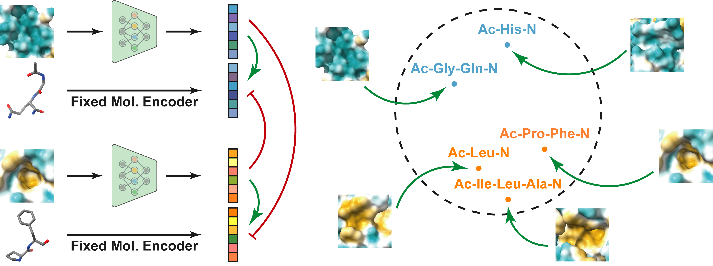

# ProFSA - Self-supervised Pocket Pretraining via Protein Fragment-Surroundings Alignment

<br>

Official repository for ["Self-supervised Pocket Pretraining via Protein Fragment-Surroundings Alignment"](https://github.com/bowen-gao/ProFSA).



**Figure:** *An illustration of protein fragment-surroundings alignment framework.*

> **Self-supervised Pocket Pretraining via Protein Fragment-Surroundings Alignment** <br>
> Bowen Gao, Yinjun Jia, Yuanle Mo, Yuyan Ni, Wei-Ying Ma, Zhi-Ming Ma, Yanyan Lan <br>
> *Published on The Twelfth International Conference on Learning Representations (ICLR 2024)*

[](https://github.com/bowen-gao/ProFSA)
[](https://arxiv.org/pdf/2310.07229.pdf)
[](https://pytorch.org/get-started/locally/)
[](https://github.com/hughplay/DeepCodebase)


<br>

## Description

Pocket representations play a vital role in various biomedical applications, such as druggability estimation, ligand affinity prediction, and de novo drug design. While existing geometric features and pretrained representations have demonstrated promising results, they usually treat pockets independent of ligands, neglecting the fundamental interactions between them. However, the limited pocket-ligand complex structures available in the PDB database (less than 100 thousand non-redundant pairs) hampers large-scale pretraining endeavors for interaction modeling. To address this constraint, we propose a novel pocket pretraining approach that leverages knowledge from high-resolution atomic protein structures, assisted by highly effective pretrained small molecule representations. By segmenting protein structures into drug-like fragments and their corresponding pockets, we obtain a reasonable simulation of ligand-receptor interactions, resulting in the generation of over 5 million complexes. Subsequently, the pocket encoder is trained in a contrastive manner to align with the representation of pseudo-ligand furnished by some pretrained small molecule encoders. Our method, named ProFSA, achieves state-of-the-art performance across various tasks, including pocket druggability prediction, pocket matching, and ligand binding affinity prediction. Notably, ProFSA surpasses other pretraining methods by a substantial margin. Moreover, our work opens up a new avenue for mitigating the scarcity of protein-ligand complex data through the utilization of high-quality and diverse protein structure databases.


## Dataset

The original dataset is located at [Google Drive](https://drive.google.com/file/d/1_Md8akleucwATBXo1Dc4ei3fxvVulkXG/view).

If you want to train or test the model on the downstream tasks, we also provide processed version of the datasets in lmdb format: [profsa.tar.gz](https://drive.google.com/file/d/1lFBe4ak7QXS4LS-qAemvWJatT9AL8huf/view?usp=drive_link).

## Environment Setups

**1. Clone the repository**

```bash
git clone https://github.com/bowen-gao/ProFSA.git
cd ProFSA
```

**2. Prepare the dataset and pretrained weights**

Download the [profsa.tar.gz](https://drive.google.com/file/d/1lFBe4ak7QXS4LS-qAemvWJatT9AL8huf/view?usp=drive_link) and decompress it under the `data` directory. 

```
mkdir data
cd data
tar -zxvf profsa.tar.gz
```

The pretrained weight [mol_pre_no_h_220816.pt](https://github.com/dptech-corp/Uni-Mol/releases/download/v0.1/mol_pre_no_h_220816.pt) comes from Uni-Mol repo.


After decompress the package, the directory structure should be like this:

```
.
|-- dataset
|   |-- lba_identity_30
|   |   |-- dict_mol.txt
|   |   |-- dict_pkt.txt
|   |   |-- read_lmdb.py
|   |   |-- test.lmdb
|   |   |-- train.lmdb
|   |   `-- valid.lmdb
|   |-- lba_identity_60
|   |   |-- dict_mol.txt
|   |   |-- dict_pkt.txt
|   |   |-- test.lmdb
|   |   |-- train.lmdb
|   |   `-- valid.lmdb
|   |-- pocket_matching
|   |   |-- P5.pkl
|   |   |-- p5_pockets.lmdb
|   |   `-- test_ligand.lmdb
|   `-- train
|       |-- dict_mol.txt
|       |-- dict_pkt.txt
|       |-- train.lmdb
|       `-- valid.lmdb
|-- log
`-- pretrain
    `-- mol_pre_no_h_220816.pt
```

**3. Build the docker image and launch the container**

```bash
make init
```

For the first time, it will prompt you the following configurations (enter for the default values):
```
Give a project name [profsa]:
Code root to be mounted at /project [.]:
Data root to be mounted at /data [./data]:
Log root to be mounted at /log [./data/log]:
directory to be mounted to hongxin [container_home]:
`/home/hongxin/code/profsa/profsa_git/container_home` does not exist in your machine. Create? [yes]:
```

After `Creating xxx ... done`, the environment is ready. You can run the following command to go inside the container:

```bash
make in
```

## Training

In the container, train a model by run:
  
```bash
zsh scripts/train/train_base.sh
```

The full command is:

```bash
python train.py experiment=base \
    seed=1 \
    trainer.precision="16-mixed" \
    logging.wandb.tags="[profsa]" \
    logging.wandb.name=profsa_fp16_4gpu \
    trainer.devices="[4,5,6,7]"
```

> Note:
*The project is based on [DeepCodebase](https://github.com/hughplay/DeepCodebase) template.*
You may need to learn some basic usage of [Pytorch Lightning](https://pytorchlightning.ai/) and [Hydra](https://hydra.cc/) to better understand the code.


## Testing

To test the model on pocket matching task, you can run:

```bash
zsh scripts/test/test_profsa_base_pm.sh
```

To test the model on ligand binding affinity prediction task, you can run:

```bash
zsh scripts/test/test_profsa_base_lba.sh
```


## Citation

If you find this code useful, please consider star this repo and cite us:

```
@inproceedings{gao2024self,
  title={Self-supervised Pocket Pretraining via Protein Fragment-Surroundings Alignment},
  author={Gao, Bowen and Jia, Yinjun and Mo, YuanLe and Ni, Yuyan and Ma, Wei-Ying and Ma, Zhi-Ming and Lan, Yanyan},
  booktitle={The Twelfth International Conference on Learning Representations},
  year={2024}
}
```